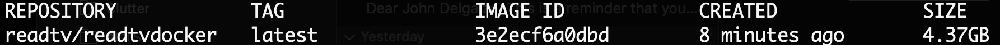
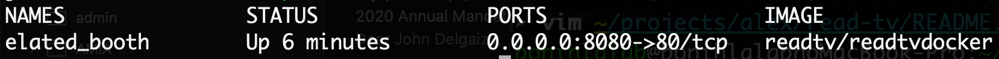

read-tv-docker  
===
Docker image for read-tv (Research & Exploratory Analysis Driven Time-data Visualization).
---

---
## Table of contents

  - [Description](#description)
  - [Installation](#installation)
      - [Requirements](#requirements)
      - [Steps](#steps)
  - [Usage](#usage)

---

## Description

This is a [Docker file](https://github.com/JDMusc/read-tv-docker/blob/master/Dockerfile) and project for the read-tv application.

read-tv is a shiny application and associated console interface designed
for visualizing changepoints in **irregularly and regularly spaced**
longitudinal data. 

More information about read-tv can be found at the [read-tv repo](https://github.com/JDMusc/READ-TV.git).

---

## Installation

### Requirements

* Docker installation
* Host OS is a Linux variant, such as Ubuntu or Mac OSX.
  * This Docker image is based from the "rocker/r-devel" image, which itself is based on a light version of Ubuntu.

### Steps

These steps are to run the application on a local machine, on port 8080.

1) Download or clone the current [github project](https://github.com/JDMusc/read-tv-docker.git)
   ``` bash
   git clone https://github.com/JDMusc/read-tv-docker.git
   ```
2) Build the docker image  
   a. cd into the read-tv-docker directory  
   b. build the docker image 
   ```bash 
   sudo docker build -t readtv/readtvdocker .
   ```
   c. You should be able to see the built image after about 30 minutes.
   ```bash
   sudo docker images
   ```   
   
3) Run and create a container from the image  
   ```bash
   sudo docker run -p 8080:80 -v [path to cloned read-tv-docker repo] -itd readtv/readtvdocker
   ```  
   * You should now see the running container
   ```bash
   sudo docker container ls --format 'table{{.Names}}\t{{.Status}}\t{{.Ports}}\t{{.Image}}'
   ```
      
   
4) Attach to the running container.   
   ```bash
   sudo docker attach elated_booth[docker will give a different name to your container]
   ```   
 While inside the container, cd to the read-tv directory
5) Launch R: ```R```
6) Run application
   ``` r
   >>> library(shiny)
   >>> runApp(port = 80, host='0.0.0.0')
   ```

---

## Usage

Open browser and type `localhost:8080` in the location bar.

There is a read-tv tutorial at the read-tv repo.